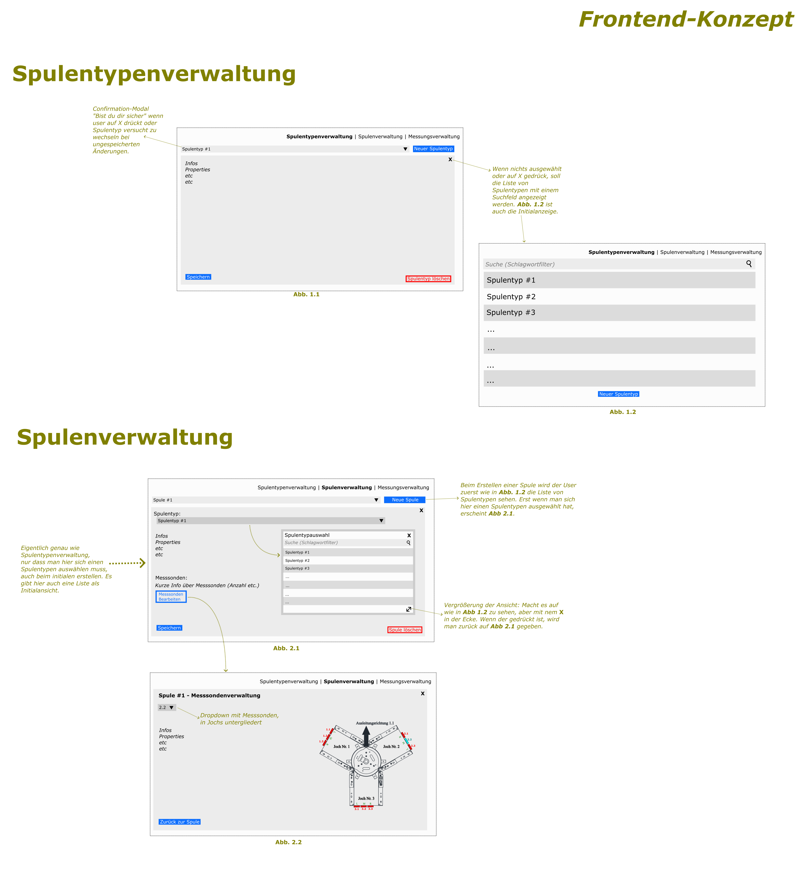

= Besprechungsprotokoll 05.01.2025

link:/01-projekte-2025-4chif-syp-trench/[Trench Project] / link:/01-projekte-2025-4chif-syp-trench/conversation-protocols/[Conversation Protocols] / *Besprechungsprotokoll 05.01.2025*

Emil Silber

.Teilnehmer
|===
|Anwesend |Relevant Für

|Emil Silber
|Filip Schauer

|Filip Schauer
|Axel Csomany

|
|Aaron Schreiegg

|
|Simon Pesut
|===

.Ort und Zeit
[cols=2*]
|===
|Ort
|Discord

|am
|So. 05.1.2024
|Dauer
|30 Minuten
|===

== Besprochene Themen

* Frontend
* API

== Vereinbarungen und Entscheidungen

.Was wurde vereinbart?
[%autowidth]
|===
|wer |möchte 

| Emil Silber
a| 

image::/01-projekte-2025-4chif-syp-trench/conversation-protocols/protocol-images/2025-01-04_frontend-concept-new.png[x]

- Anhand der erklärten Kriterien für das neue Frontend wurde das folgende Konzept von Filip Schauer erstellt und erklärt.

- Das Konzept ist bis auf folgende zu implementieren
|===