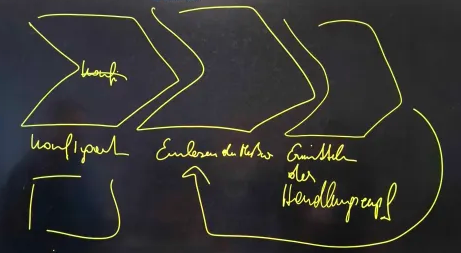

= Besprechungsprotokoll 09.12.2024

link:/01-projekte-2025-4chif-syp-trench/[Trench Project] / link:/01-projekte-2025-4chif-syp-trench/conversation-protocols/[Conversation Protocols] / *Besprechungsprotokoll 09.12.2024*

Emil Silber

.Teilnehmer
|===
|Anwesend |Relevant Für

|Trench-Team
|Trench-Team

|Prof. Stütz
|

|===

.Ort und Zeit
[cols=2*]
|===
|Ort
|Raum 147

|am
|Mo. 09.12.2024
|Dauer
|30 Minuten
|===

== Besprochene Themen

* Systemarchitektur
* Schnittstellen
* Protokollieren
* Mocking

== Vereinbarungen und Entscheidungen

.Was wurde vereinbart?
[%autowidth]
|===
|wer |möchte 

| Prof. Stütz
a| 

- Wir sollen Dr.Köck fragen, wie wir die Daten erhalten werden:
1.	USB
2.	MQTT
3.	USB + MQTT

- Telegraf wäre eine Möglichkeit, wie wir mit den Daten umgehen können bei MQTT (MQTT -> Postgre). Sollten wir doch EMQX wollen, müssen wir es nächstes mal genauer erklären.

- Eine Möglichkeit die Gesprächsprotokolle zu bennenen wäre: jahr-monat-tag-Thema z.B. 2024-12-09-Trench-Systemarchitektur

- Sollte Dr.Köck sich für USB entscheiden, brauchen wir:
    1. Beispielsdaten wie sie am USB Sticks sind
    2. In welchem Format bekommen wir die Daten am USB Stick

- Mocking mit daten. Frontend mit fake Daten 

- Prozessablaufdiagram:

image::/01-projekte-2025-4chif-syp-trench/conversation-protocols/protocol-images/2024-12-11_diagram.png[x]

Konfiguration => Einlesen der Messwerte => Ermitteln der Handlungsempfehlung 

|===