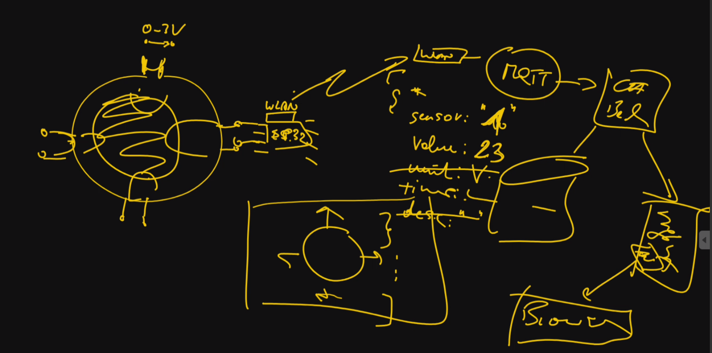

= Besprechungsprotokoll 11.12.2024 (1)

link:/01-projekte-2025-4chif-syp-trench/[Trench Project] / link:/01-projekte-2025-4chif-syp-trench/conversation-protocols/[Conversation Protocols] / *Besprechungsprotokoll 11.12.2024 (1)*

Emil Silber

.Teilnehmer
|===
|Anwesend |Relevant Für

|Trench-Team
|Trench-Team

|Prof. Stütz
|

|===

.Ort und Zeit
[cols=2*]
|===
|Ort
|Raum 147

|am
|Mi. 11.12.2024
|Dauer
|20 Minuten
|===

== Besprochene Themen

* Messungen
* Technologien
* Schnittstellen

== Vereinbarungen und Entscheidungen

.Was wurde vereinbart?
[%autowidth]
|===
|wer |möchte 

| Prof. Stütz
a| 

- Nach einem Anruf mit Dr. Köck hat sich folgendes ergeben:
1.	Er wird keine USB-Schnittstelle geben, deswegen werden wir MQTT verwenden.
2.	Das Backend soll in C# geschrieben werden
3.	Die Messung wird periodisch sein, der Intervall ist mit 5-10 Sekunden zu erwarten
4.	Die Messungen werden folgend stattfinden:
a.	Der Tauchkern wird ganz oben gemessen
b.	Der Tauchkern wird ganz unten gemessen
c.	Der Tauchkern wird in der Mitte gemessen
d.	Abweichungen möglich

- Folgende relevante Informationen wurden gegeben:
1.	Positionen der Sensoren werden in der Konfigurationsphase festgestellt.
2.	Sensoren werden 0-3 Volt machen.
3.	Sensoren werden mit einem ESP32 verbunden. Entweder werden alle eine individuell bekommen oder sie werden alle an eine ESP32 gebunden.
4.	Die Daten, die gesendet werden müssen, wir noch genauer ausmachen mit Prof. Stütz, möglicher Format:
a.	Sensor: 1
b.	Value (Entfernung): 23 mm
c.	Time: 
d.	Description:

image::/01-projekte-2025-4chif-syp-trench/conversation-protocols/protocol-images/2024-12-11_diagram.png[x]

Erklärung:

Das WLAN-Box in der ESP32, schickt die Daten an MQTT, welches dann mithilfe eines MQTT-Brokers es an das C# Backend weiterleitet. Das Backend verarbeitet die Daten und speichert sie in der Datenbank und schickt es, mit NGINX, an das Frontend, dies wird dann von Angular im Browser dargestellt.

- Stütz wird uns das C# Backend von Aitenbichler gebenden. Wir sollen die benutzten Libraries und Methoden analysieren, dann selbst schreiben.

|===