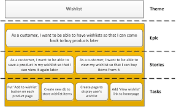
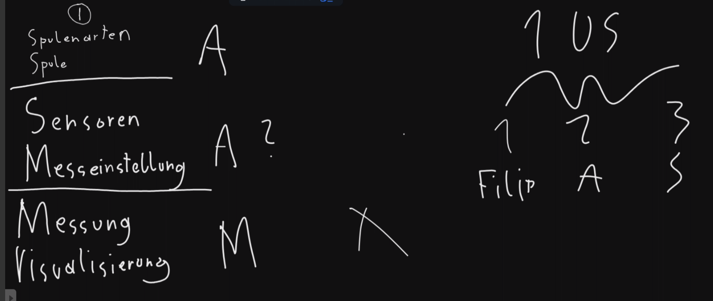

= Besprechungsprotokoll 19.12.2024 (2)

link:/01-projekte-2025-4chif-syp-trench/[Trench Project] / link:/01-projekte-2025-4chif-syp-trench/conversation-protocols/[Conversation Protocols] / *Besprechungsprotokoll 19.12.2024 (2)*

Emil Silber

|===
|Anwesend |Relevant Für

|Emil Silber
|Trench-Team

|Prof. Palitsch-Infanger
|

|===

.Ort und Zeit
[cols=2*]
|===
|Ort
|Raum 147

|am
|Mi. 19.12.2024
|Dauer
|2 Stunden
|===

== Besprochene Themen

* Epic, User stories, Tasks
* Nach Weihnachten

== Vereinbarungen und Entscheidungen

.Was wurde vereinbart?
[%autowidth]
|===
|wer |möchte 

| Prof. Palitsch-Infanger
a|- Nach dem Weihnachtsferien sollen wir mindestens eine funktionierendes Frontend, Backend und eine Datenbank haben
- Die derzeitige Vorgehensweise in der Projektmanagement ist schwach und unproduktiv.
*Lösungsvorschlag*: User stories und Tasks zuteilen 

image::/01-projekte-2025-4chif-syp-trench/conversation-protocols/protocol-images/2024-12-19_epic-userstories.png[x]

- Es wurden folgende Begriffe ausführlich im Kontext vom YouTrack erklärt:
1. Epik: Zusammenfassung von User Stories
2. User story: Aussicht vom Kunden
3. Task: Eine Aufgabenstellung 

- Das Konzept des Projektes wurde besprochen und die verschiedene Stages von der App wurde analyisiert und erklärt:

image::/01-projekte-2025-4chif-syp-trench/conversation-protocols/protocol-images/2024-12-19_project-concept.png[x]

- Nach der Weihnachtsferien muss unbedingt ein lauffähiges Projekt präsentiert werden (Sprint "Functionality":  19. Dez - 8. Jan)
|===