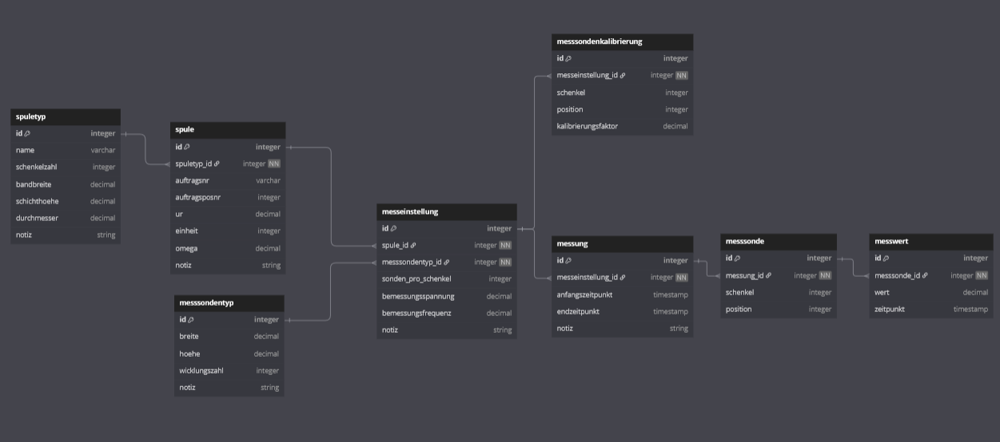
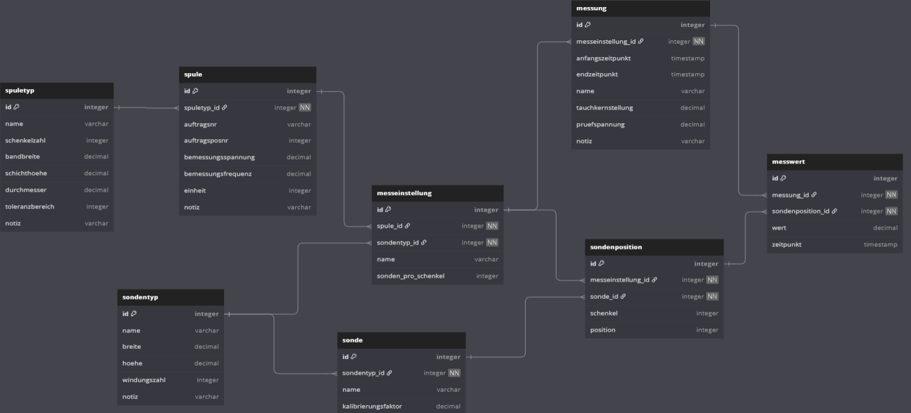
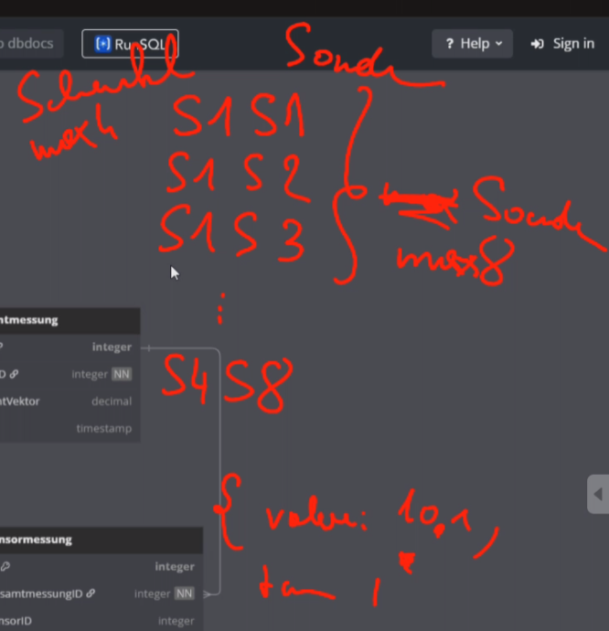
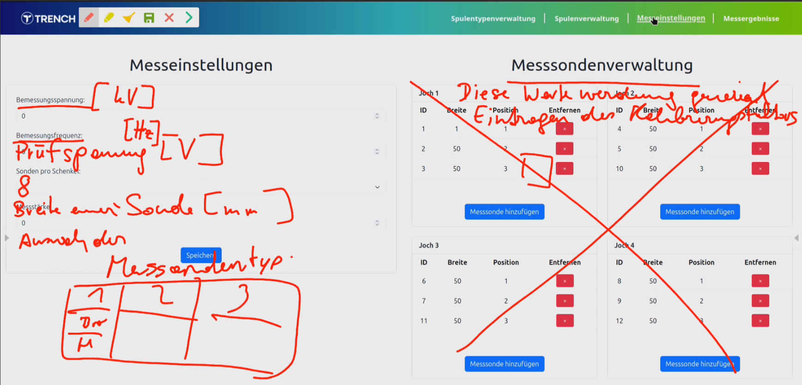

= Besprechungsprotokoll 07.04.2025

link:/01-projekte-2025-4chif-syp-trench/[Trench Project] / link:/01-projekte-2025-4chif-syp-trench/conversation-protocols/[Conversation Protocols] / *Besprechungsprotokoll 07.04.2025*

Emil Silber

.Teilnehmer
|===
|Anwesend

|Dr. Köck
|Prof. Palitsch-Infanger
|Emil Silber
|Filip Schauer
|Axel Csomany
|Simon Pesut
|Aaron Schreiegg

|===

.Ort und Zeit
[cols=2*]
|===
|Ort
|Aula

|am
|Mi. 07.04.2025
|Dauer
|2 Stunden
|===

== Besprochene Themen

* Monteur - Admin 
* Zukunftsaussichten
* ERD
* Messungen (Speichern, Verlauf)
* Visualisierung
* Toleranzbereich
* Messsondenverwaltung

== Vereinbarungen und Entscheidungen

.Was wurde vereinbart?
[%autowidth]
|===
|wer |möchte 

| Dr. Köck
a|

== Monteur - Admin

Es soll eine Trennung zwischen Monteur und Admin geben.
Der Admin verwaltet die Spulentypen und Sensortypen. Der Monteur legt Spulen und Sensoren (?) an, misst und hat Zugriff auf alle Messwerte. Der Admin hat zusätzlich Zugriff auf alle Monteurfunktionen.

Wenn man sich einloggt, ist man im Monteur-Modus. Oben rechts gibt es einen Button, um mit einem zusätzlichen Passwort in den Admin-Modus zu wechseln. 

Sollte der Nutzer derzeit im Monteur-Modus sein, werden Admin-only Funktionen ausgegraut. 

== Zukunftsaussichten
Das Endprodukt soll eine Webseite sein, welches auf einem privatem Netzwerk läuft.
In den kommenden Wochen muss das Datenmodell eingefroren werden, was bedeutet, dass keine weiteren Änderungen daran vorgenommen werden dürfen, damit die Webseite darauf aufbauen kann.

== ERD
**ALTES ERD:**

**NEUES ERD:**

== Änderungen:

=== Tables

- messsondentyp → sondentyp
- messsondenkalibrierung removed
- messsonde split into sonde + sondenposition

+ sonde (id, sondentyp_id, name, kalibrierungsfaktor)
+ sondenposition (id, sonde_id, messeinstellung_id, schenkel, position)

=== spule

- ur, omega
+ bemessungsspannung, bemessungsfrequenz

=== Spuletyp

+ toleranzbereich

=== Messeinstellung

- messsondentyp_id → sondentyp_id
- bemessungsspannung, bemessungsfrequenz
+ name

=== Messung

+ name, tauchkernstellung, pruefspannung

=== Messwert

- messsonde_id
+ sondenposition_id

=== Einheiten
- `spuletyp.bandbreite`: mm
- `spuletyp.schichthoehe`: mm
- `spuletyp.durchmesser`: mm
- `spuletyp.toleranzbereich`: N (or kN if decimal)
- `spuletyp.tauchkernstellung`: Ampere

- `spule.bemessungsspannung`: V
- `spule.bemessungsfrequenz`: Hz

== ESP32

Die Sonden wissen ihre Position anhand von dem ESP32. Die jeweiligen Ports von dem ESP definieren die genaue Position von den Sonden

== Messungen (Speichern, Verlauf)

Während einer Messung können sich die Messwerte ein wenig ändern (im Sekundentakt). Die Messwerte sollen nur gespeichert werden, wenn der Monteur auf speichern drückt, und nicht laufend und automatisch. 

== Visualiserung

Der Vektor wird anhand vom Winkel und Betrag ausgerechnet. Die Amplitude ändert sich

Die derzeitige Visualierung ist nicht akkurat. Es soll mit den Formeln aus der Excel Tabelle ausgerechnet werden.

Die Grafik muss zuerst dargestellt werden und die Messwerte sollen nach unten.

== Toleranzbereich
Ein neues Attribut "Toleranzbereich" bei der Entität Spulentyp bestimmt, in welchem Bereich die Messwerte bei dem Gesamtvektor in der Visualisierung liegen müssen. Alles innerhalb ist mit einem grünen Innenkreis repräsentiert, und alles außerhalb des Bereiches ist rot repräsentiert.

== Messsondenverwaltung

Die Sonden sollen wiederverwendbar sein in der Messsondenverwaltung. Während der Konfiguration der Sonden sollen sie in einer Tabelle zur Auswahl angezeigt werden. Die ausgewählten Sonden können dann der gewählten Spule zugewiesen werden. Die Sonden selbst werden automatisch basierend auf dem Messsondentyp und dem Attribut `sonden_pro_joch` aus der Messung erstellt.

|===