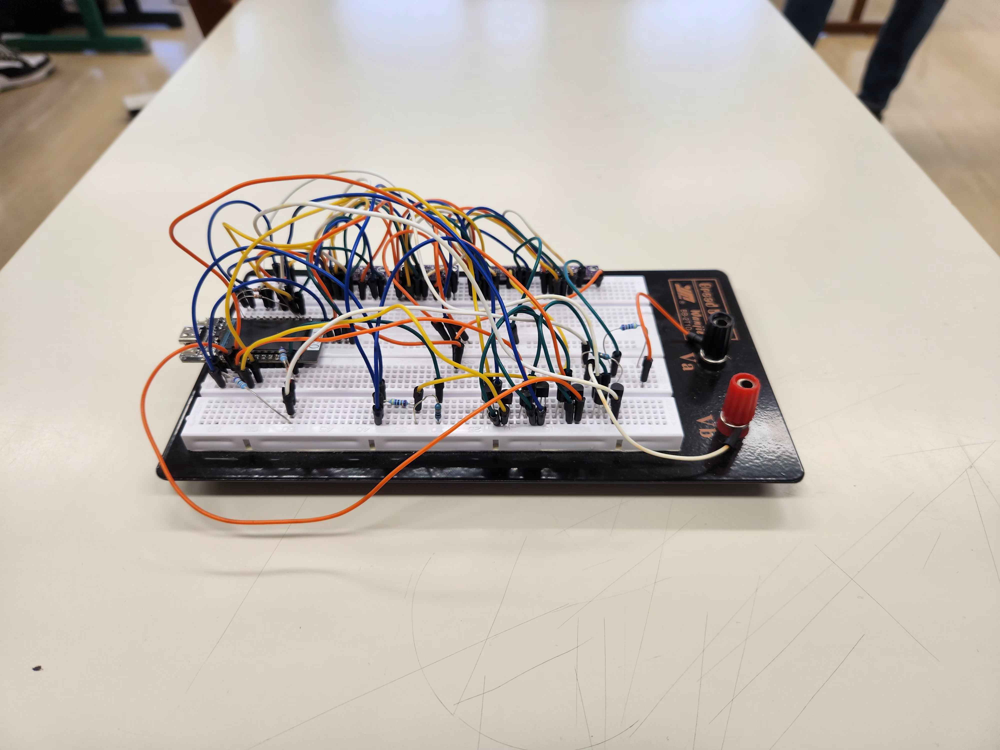
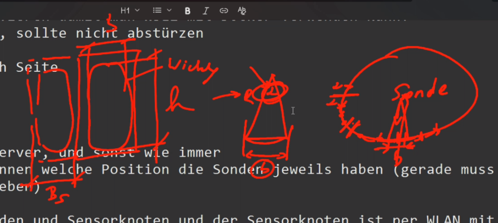

= Besprechungsprotokoll 20.10.2025

link:/01-projekte-2025-4chif-syp-trench/[Trench Project] / link:/01-projekte-2025-4chif-syp-trench/conversation-protocols/[Conversation Protocols] / *Besprechungsprotokoll 20.10.2025*

Simon Pesut

.Teilnehmer
|===
|Anwesend

|Dr. Köck
|Michael Palitsch
|Emil Silber
|Filip Schauer
|Axel Csomany
|Simon Pesut
|Aaron Schreiegg

|===

.Ort und Zeit
[cols=2*]
|===
|Ort
|HTL Leonding

|am
|Mo. 20.10.2025
|Dauer
|2 Stunden
|===

== Besprochene Themen

* Trench-Notebook Setup
* Fortschritt auf der Trench Seite
* Sensorknoten
* Offene Fragen zu Spulenaufbau und Sensorkonfiguration
* Alpha-Parameter und maximale Sondenanzahl
* Project Awards Vorbereitung

== Trench-Notebook

Das Trench-Notebook benötigt BIOS-Änderungen für die Virtualisierung:

* Virtualisierung im BIOS aktivieren, damit WSL2 mit Docker verwendet werden kann
* Test: Docker Desktop starten, sollte nicht abstürzen
* Rückfragen an Simon Pesut
** Email: s.pesut@students.htl-leonding.ac.at
** Telefon: 0650 7003292

== Fortschritt auf der Trench Seite

=== Sensorknoten

* 1 Sensorknoten pro Joch entwickelt
* Max. 8 Sonden pro Joch
* Sensorknoten hängt am MQTT-Server
* Der Sensorknoten sollte erkennen, welche Position die Sonden jeweils haben (aktuell muss man manuell die Position in der App eingeben)
* Kabelverbindung zwischen Sonden und Sensorknoten
* Sensorknoten ist per WLAN mit dem MQTT verbunden

image::../protocol-images/2025-10-20_UpView.jpg[]

== Offene Fragen und Klärungen

=== Auftragsnummern
* Auftragsnummer und Auftragspositionsnummer bei Trench: numerisch oder auch String möglich (wird nicht für Berechnungen verwendet)

=== Joche und Sonden

* Joche werden im Uhrzeigersinn nummeriert
* Sondendifferenzwinkel = Alpha
* Ausleitung ist zwischen Joch 1 und Joch 2

=== Sondenpositionen

Wir haben nur Breite und Höhe von Wicklung, aber nicht die Außenmaße der Sonde.

* Bei **ungerader** Sondenanzahl: die Sonde in der Mitte ist bei 180 Grad
* Bei **gerader** Sondenanzahl: 180 ± Alpha/2

=== Alpha-Parameter

Aus Alpha und Anzahl der Rückschlussjoche ergibt sich die maximale Anzahl der Sonden pro Joch.

**Neue Entität Sondentyp Attribute:**

* Alpha (Dezimalzahl)
* Einheit: Grad

**Formel für maximale Anzahl:**

----
Maximale Anzahl von Sonden pro Joch = floor(360 / Joche / Alpha)
----

**Formel für A_IJ:**

----
A_IJ = dm * π * BB / Schenkelzahl
----

=== Frontend/Backend Anforderungen

* Bei Messeinstellung Plausibilitätsprüfung einbauen
* Alpha im Frontend: Eingabe Dezimalzahl mit Komma und Punkt erlauben
* Auswahlmöglichkeiten von Sonden pro Schenkel: 1 bis max
* MQTT-Text: optionales Mapping zu den Positionen

=== Weitere Klärungen

* Tauchkernstellung: Dezimal passt, ist in Ampere
* Durchmesser von den Sonden ≠ Durchmesser der Spule
* **Best Practice:** Alpha als Parameter eingeben (Property vom Sondentyp, Einheit Grad)
* Kalibrierungsfaktor ist Multiplikator und nicht %

== Aufgaben

[%autowidth]
|===
|Wer |Aufgabe

|Aaron Schreiegg
|Alpha im Frontend implementieren / Eingabe Dezimalzahl mit Komma und Punkt / Auswahlmöglichkeiten von Sonden pro Schenkel 1 bis max

|Simon Pesut
|Alpha im Backend für Datenbank implementieren

|Filip Schauer
|Alpha in die Berechnungen einbauen

|Emil Silber
|Sensorknoten in Systemarchitektur einpflegen

|Dr. Köck
|Neues SVG für eine 4-Joch-Spule bereitstellen

|===

== Wichtige Termine und Hinweise

* **Anfang März:** Projekt muss für Project Awards fertig sein
* Sauberer Umgang mit vertraulichen Daten erforderlich
* User-Story: Echtzahlen durcheinanderwürfeln
